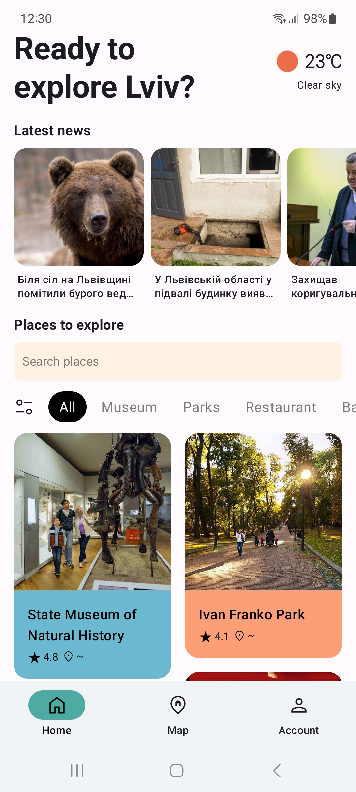
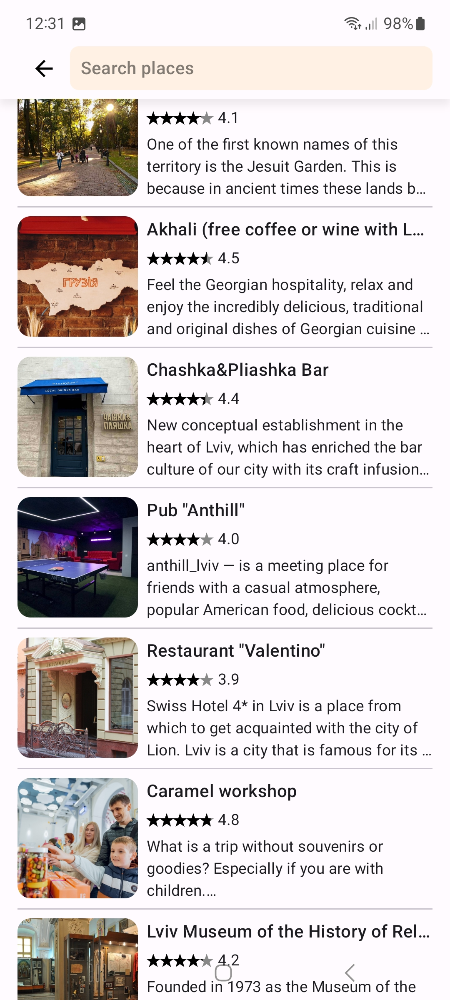
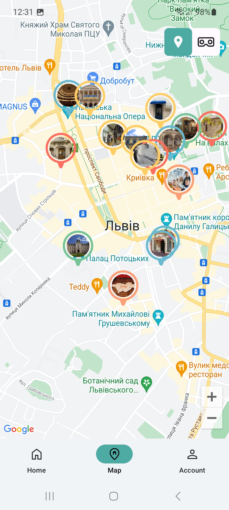

# LvivGuide

This app was built using Jetpack Compose and Node.js as a backend. The program itself is built on a multi-module architecture and uses the following technological solutions:

* Google Maps.
* GraphQL.
* Integration of Pagging 3 with RemoteMediators.
* Development of a custom data adapter for Retrofit.
* Integration with Architecture Components such as Navigation and ViewModel, leveraging their capabilities to enhance the app's functionality.
* WebView.

## Screenshots

</img>
</img>
</img>

